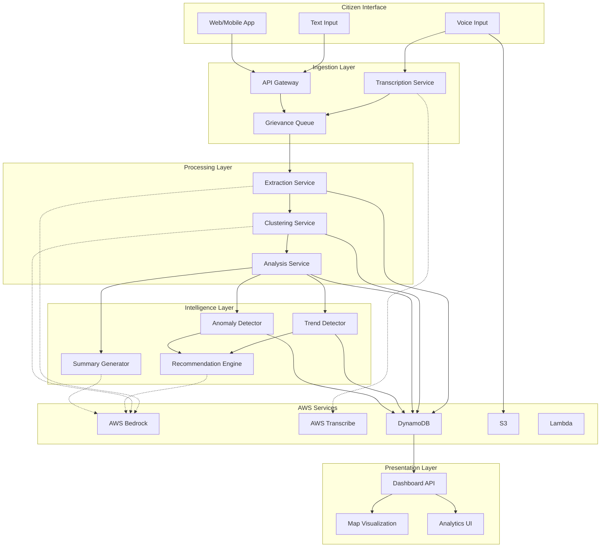

# Design Document: GenAI-Powered Community Grievance Intelligence Platform

## Overview

The GenAI-Powered Community Grievance Intelligence Platform is a cloud-native system that transforms unstructured citizen complaints into actionable civic intelligence. The platform leverages AWS Bedrock's pre-trained LLMs to extract structured information, semantically cluster related grievances, detect trends and anomalies, and generate actionable insights for municipal authorities.

The system follows an event-driven architecture where grievance submissions trigger a processing pipeline that includes transcription (for voice), LLM-based extraction, semantic clustering, and continuous pattern analysis. All components are designed to scale horizontally on AWS infrastructure without requiring custom model training.

## Architecture

### High-Level Architecture



### Component Responsibilities

1. **Ingestion Layer**: Receives grievances, handles voice transcription, queues for processing
2. **Processing Layer**: Extracts structured data, performs semantic clustering, stores results
3. **Intelligence Layer**: Detects patterns, generates insights, creates recommendations
4. **Presentation Layer**: Provides APIs and visualizations for end users

### Data Flow

1. Citizen submits grievance (text or voice)
2. Voice grievances transcribed via AWS Transcribe
3. Grievance queued for processing
4. LLM extracts structured information (domain, severity, location, summary)
5. Embedding generated and compared against existing clusters
6. Grievance assigned to cluster (new or existing)
7. Background jobs analyze trends and anomalies
8. Weekly summary generation triggered on schedule
9. Dashboard displays real-time insights and visualizations

## Components and Interfaces

### 1. Grievance Submission API

**Purpose**: Accept and validate citizen grievances

**Interface**:
```typescript
interface GrievanceSubmissionRequest {
  content: string;           // Text content or empty if voice
  voiceFileUrl?: string;     // S3 URL if voice submission
  submittedBy?: string;      // Optional citizen identifier
  submittedAt: Date;
}

interface GrievanceSubmissionResponse {
  grievanceId: string;
  status: 'received' | 'processing' | 'failed';
  message: string;
}
```

**Responsibilities**:
- Validate input length (10-5000 characters for text)
- Generate unique grievance ID
- Store raw grievance in DynamoDB
- Publish to processing queue
- Return confirmation to citizen

### 2. Voice Transcription Service

**Purpose**: Convert voice grievances to text using AWS Transcribe

**Interface**:
```typescript
interface TranscriptionRequest {
  grievanceId: string;
  audioFileUrl: string;
  language?: string;
}

interface TranscriptionResponse {
  grievanceId: string;
  transcribedText: string;
  confidence: number;        // 0.0 to 1.0
  needsReview: boolean;      // true if confidence < 0.8
}
```

**Responsibilities**:
- Invoke AWS Transcribe with audio file
- Handle multiple languages
- Flag low-confidence transcriptions
- Update grievance record with transcribed text

### 3. Structured Information Extraction Service

**Purpose**: Extract domain, severity, location, and summary using LLM

**Interface**:
```typescript
interface ExtractionRequest {
  grievanceId: string;
  content: string;
}

interface StructuredData {
  domain: string;            // e.g., "sanitation", "roads", "water_supply"
  severity: 'low' | 'medium' | 'high' | 'critical' | 'unknown';
  locationHints: string[];   // Extracted location references
  summary: string;           // Max 200 characters
  confidence: {
    domain: number;
    severity: number;
    location: number;
  };
}

interface ExtractionResponse {
  grievanceId: string;
  structuredData: StructuredData;
}
```

**LLM Prompt Template**:
```
Analyze the following citizen grievance and extract structured information:

Grievance: {content}

Extract:
1. Civic Domain (sanitation, roads, water_supply, electricity, drainage, parks, noise, pollution, other)
2. Severity Level (low, medium, high, critical)
3. Location Hints (any geographic references like street names, landmarks, neighborhoods)
4. Summary (concise description in max 200 characters)

Return as JSON with confidence scores for each field.
```

**Responsibilities**:
- Invoke AWS Bedrock with extraction prompt
- Parse LLM response into structured format
- Handle cases where LLM cannot extract fields
- Store structured data with grievance

### 4. Semantic Clustering Service

**Purpose**: Group grievances by meaning using embeddings

**Interface**:
```typescript
interface ClusteringRequest {
  grievanceId: string;
  content: string;
  structuredData: StructuredData;
}

interface Cluster {
  clusterId: string;
  label: string;             // Descriptive label
  domain: string;
  grievanceIds: string[];
  centroidEmbedding: number[];
  createdAt: Date;
  updatedAt: Date;
}

interface ClusteringResponse {
  grievanceId: string;
  clusterId: string;
  isNewCluster: boolean;
  similarity: number;        // Similarity to cluster centroid
}
```

**Algorithm**:
1. Generate embedding for grievance using AWS Bedrock
2. Compare against existing cluster centroids (cosine similarity)
3. If max similarity >= 0.75, assign to that cluster
4. If max similarity < 0.75, create new cluster
5. Update cluster centroid as running average of embeddings
6. Regenerate cluster label if composition changes significantly

**Responsibilities**:
- Generate embeddings via AWS Bedrock
- Maintain cluster metadata in DynamoDB
- Assign grievances to clusters
- Update cluster labels using LLM

### 5. Trend Detection Service

**Purpose**: Identify patterns across time and geography

**Interface**:
```typescript
interface TrendAnalysisRequest {
  timeWindow: 'daily' | 'weekly' | 'monthly';
  domain?: string;           // Optional filter
  location?: string;         // Optional filter
}

interface Trend {
  trendId: string;
  type: 'rising' | 'declining' | 'stable';
  clusterId: string;
  domain: string;
  locations: string[];
  growthRate: number;        // Percentage change
  timeSpan: {
    start: Date;
    end: Date;
  };
  grievanceCount: number;
  severity: string;
}

interface TrendAnalysisResponse {
  trends: Trend[];
  detectedAt: Date;
}
```

**Detection Logic**:
- Query grievances in time windows (1 day, 7 days, 30 days)
- Group by cluster and domain
- Calculate growth rates between windows
- Flag as rising trend if growth >= 50% over 7 days
- Identify geographic concentration using location hints

**Responsibilities**:
- Run periodic analysis (hourly)
- Calculate trend metrics
- Store trends in DynamoDB
- Trigger alerts for significant trends

### 6. Anomaly Detection Service

**Purpose**: Identify unusual patterns and emerging issues

**Interface**:
```typescript
interface AnomalyDetectionRequest {
  domain?: string;
  location?: string;
}

interface Anomaly {
  anomalyId: string;
  type: 'volume_spike' | 'new_cluster' | 'severity_spike';
  domain: string;
  location?: string;
  description: string;
  detectedAt: Date;
  baselineValue: number;
  currentValue: number;
  deviationScore: number;    // Standard deviations from baseline
}

interface AnomalyDetectionResponse {
  anomalies: Anomaly[];
}
```

**Detection Methods**:
1. **Volume Spike**: Current volume > baseline + 2 * stddev
2. **New Cluster**: Cluster created with no similar historical clusters
3. **Severity Spike**: Sudden increase in high/critical severity grievances

**Baseline Calculation**:
- Maintain 30-day rolling baseline per domain and location
- Calculate mean and standard deviation
- Update daily

**Responsibilities**:
- Maintain baseline statistics
- Run anomaly detection hourly
- Generate alerts for detected anomalies
- Store anomalies in DynamoDB

### 7. Recommendation Engine

**Purpose**: Generate actionable recommendations using LLM

**Interface**:
```typescript
interface RecommendationRequest {
  clusterId?: string;
  trendId?: string;
  anomalyId?: string;
}

interface Recommendation {
  recommendationId: string;
  priority: 'low' | 'medium' | 'high' | 'urgent';
  title: string;
  description: string;
  suggestedActions: string[];
  affectedAreas: string[];
  estimatedImpact: string;
  relatedClusters: string[];
}

interface RecommendationResponse {
  recommendations: Recommendation[];
}
```

**LLM Prompt Template**:
```
Analyze the following civic grievance pattern and provide actionable recommendations:

Cluster: {clusterLabel}
Domain: {domain}
Grievance Count: {count}
Severity: {severity}
Locations: {locations}
Sample Grievances: {samples}

Provide:
1. Priority level (low, medium, high, urgent)
2. Recommended actions for municipal authorities
3. Estimated impact of addressing this issue
4. Resource allocation suggestions

Return as structured JSON.
```

**Responsibilities**:
- Generate recommendations for clusters, trends, and anomalies
- Prioritize based on severity and affected population
- Identify root causes across related clusters
- Store recommendations in DynamoDB

### 8. Weekly Summary Generator

**Purpose**: Create comprehensive weekly reports using LLM

**Interface**:
```typescript
interface WeeklySummaryRequest {
  weekStartDate: Date;
  weekEndDate: Date;
}

interface WeeklySummary {
  summaryId: string;
  period: {
    start: Date;
    end: Date;
  };
  totalGrievances: number;
  topTrends: Trend[];
  detectedAnomalies: Anomaly[];
  domainDistribution: Record<string, number>;
  severityDistribution: Record<string, number>;
  geographicInsights: string;
  narrativeSummary: string;  // Natural language summary
  recommendations: Recommendation[];
}
```

**LLM Prompt Template**:
```
Generate a weekly civic grievance summary for municipal decision-makers:

Period: {startDate} to {endDate}
Total Grievances: {count}

Top Trends:
{trends}

Anomalies Detected:
{anomalies}

Domain Distribution:
{domainStats}

Geographic Hotspots:
{geoStats}

Create a narrative summary suitable for non-technical readers that highlights:
1. Key issues requiring attention
2. Emerging patterns
3. Areas of improvement
4. Recommended priorities for the coming week

Use clear, actionable language.
```

**Responsibilities**:
- Aggregate weekly statistics
- Invoke LLM for narrative generation
- Compile recommendations
- Store and distribute summary

### 9. Hotspot Visualization Service

**Purpose**: Provide geographic visualization of grievance patterns

**Interface**:
```typescript
interface HotspotRequest {
  domain?: string;
  severity?: string;
  timeRange: {
    start: Date;
    end: Date;
  };
}

interface Hotspot {
  location: {
    latitude: number;
    longitude: number;
  };
  intensity: number;         // Grievance count
  grievanceIds: string[];
  dominantCluster: string;
  dominantDomain: string;
}

interface HotspotResponse {
  hotspots: Hotspot[];
  mapBounds: {
    north: number;
    south: number;
    east: number;
    west: number;
  };
}
```

**Location Resolution**:
- Extract location hints from structured data
- Use geocoding service to convert to coordinates
- Aggregate grievances within 500m radius
- Calculate intensity based on count and severity

**Responsibilities**:
- Geocode location hints
- Aggregate grievances spatially
- Calculate hotspot intensity
- Provide filtered map data

## Data Models

### Grievance

```typescript
interface Grievance {
  grievanceId: string;       // Primary key
  content: string;           // Original text
  voiceFileUrl?: string;     // S3 URL if voice
  transcribedText?: string;  // From AWS Transcribe
  transcriptionConfidence?: number;
  submittedBy?: string;
  submittedAt: Date;
  processedAt?: Date;
  status: 'received' | 'processing' | 'processed' | 'failed';
  structuredData?: StructuredData;
  clusterId?: string;
  embedding?: number[];
}
```

**Storage**: DynamoDB table with grievanceId as partition key

**Indexes**:
- GSI on submittedAt for time-based queries
- GSI on clusterId for cluster-based queries
- GSI on domain for domain-based queries

### Cluster

```typescript
interface Cluster {
  clusterId: string;         // Primary key
  label: string;
  domain: string;
  grievanceIds: string[];
  grievanceCount: number;
  centroidEmbedding: number[];
  createdAt: Date;
  updatedAt: Date;
  lastLabelUpdate: Date;
}
```

**Storage**: DynamoDB table with clusterId as partition key

**Indexes**:
- GSI on domain for domain-based queries
- GSI on updatedAt for recent activity queries

### Trend

```typescript
interface Trend {
  trendId: string;           // Primary key
  type: 'rising' | 'declining' | 'stable';
  clusterId: string;
  domain: string;
  locations: string[];
  growthRate: number;
  timeSpan: {
    start: Date;
    end: Date;
  };
  grievanceCount: number;
  severity: string;
  detectedAt: Date;
}
```

**Storage**: DynamoDB table with trendId as partition key

**Indexes**:
- GSI on detectedAt for time-based queries
- GSI on domain for domain-based queries

### Anomaly

```typescript
interface Anomaly {
  anomalyId: string;         // Primary key
  type: 'volume_spike' | 'new_cluster' | 'severity_spike';
  domain: string;
  location?: string;
  description: string;
  detectedAt: Date;
  baselineValue: number;
  currentValue: number;
  deviationScore: number;
}
```

**Storage**: DynamoDB table with anomalyId as partition key

**Indexes**:
- GSI on detectedAt for time-based queries
- GSI on domain for domain-based queries

### Baseline Statistics

```typescript
interface BaselineStats {
  statsId: string;           // Primary key: domain#location#date
  domain: string;
  location: string;
  date: Date;
  grievanceCount: number;
  mean: number;
  stddev: number;
  severityDistribution: Record<string, number>;
}
```

**Storage**: DynamoDB table with statsId as partition key

### Weekly Summary

```typescript
interface WeeklySummary {
  summaryId: string;         // Primary key
  period: {
    start: Date;
    end: Date;
  };
  totalGrievances: number;
  topTrends: Trend[];
  detectedAnomalies: Anomaly[];
  domainDistribution: Record<string, number>;
  severityDistribution: Record<string, number>;
  geographicInsights: string;
  narrativeSummary: string;
  recommendations: Recommendation[];
  generatedAt: Date;
}
```

**Storage**: DynamoDB table with summaryId as partition key

**Indexes**:
- GSI on period.start for time-based queries

## Correctness Properties

*A property is a characteristic or behavior that should hold true across all valid executions of a system—essentially, a formal statement about what the system should do. Properties serve as the bridge between human-readable specifications and machine-verifiable correctness guarantees.*


### Core Processing Properties

Property 1: Grievance acceptance and storage
*For any* valid text grievance (10-5000 characters), submitting it should result in the grievance being stored with a unique identifier that is returned in the response.
**Validates: Requirements 1.1, 1.4**

Property 2: Voice transcription invocation
*For any* voice grievance submission, the platform should invoke transcription and store both the audio file and the transcribed text.
**Validates: Requirements 1.2, 13.5**

Property 3: Timestamp assignment
*For any* grievance submission, the stored grievance should have a timestamp reflecting the submission time.
**Validates: Requirements 1.3**

Property 4: Structured data extraction completeness
*For any* processed grievance, the platform should extract and store structured data including domain, severity, summary (≤200 chars), and location hints (when present), with each field either populated or marked as "unknown".
**Validates: Requirements 2.1, 2.2, 2.3, 2.4, 2.5, 2.6, 2.7**

Property 5: Embedding generation for clustering
*For any* new grievance, the platform should generate an embedding vector before cluster assignment.
**Validates: Requirements 3.1**

Property 6: Cluster assignment completeness
*For any* processed grievance, it should be assigned to exactly one cluster - either an existing cluster (if similarity ≥ 0.75) or a new cluster (if similarity < 0.75).
**Validates: Requirements 3.2, 3.3, 3.4**

Property 7: Cluster labeling
*For any* cluster, it should have a non-empty descriptive label generated by LLM analysis.
**Validates: Requirements 3.5**

Property 8: Cluster label updates
*For any* cluster that receives grievances significantly changing its composition, the cluster label should be regenerated to reflect the new composition.
**Validates: Requirements 3.6**

### Trend and Anomaly Detection Properties

Property 9: Multi-window trend analysis
*For any* time period, the platform should analyze grievance patterns across daily, weekly, and monthly windows.
**Validates: Requirements 4.1**

Property 10: Rising trend detection
*For any* semantic cluster showing increasing frequency over time, the platform should flag it as a rising trend.
**Validates: Requirements 4.2**

Property 11: Geographic trend detection
*For any* set of grievances with location hints, the platform should analyze and detect geographic concentration patterns.
**Validates: Requirements 4.3**

Property 12: Domain trend threshold detection
*For any* civic domain showing ≥50% increase in grievances over 7 days, the platform should flag it as a trending domain.
**Validates: Requirements 4.4**

Property 13: Trend metadata completeness
*For any* detected trend, it should include growth rate, affected locations, time span, and grievance count.
**Validates: Requirements 4.5**

Property 14: Baseline establishment
*For any* civic domain and geographic area with grievance data, the platform should maintain baseline statistics (mean, stddev).
**Validates: Requirements 5.1**

Property 15: Volume anomaly detection
*For any* domain/location where current grievance volume exceeds baseline + 2*stddev, the platform should flag a volume spike anomaly.
**Validates: Requirements 5.2**

Property 16: Novel pattern detection
*For any* grievance that doesn't match existing clusters (similarity < 0.75 to all), the platform should flag it as an emerging issue.
**Validates: Requirements 5.3**

Property 17: Severity spike detection
*For any* civic domain showing sudden increase in high/critical severity grievances, the platform should detect and flag a severity spike.
**Validates: Requirements 5.4**

Property 18: Anomaly metadata completeness
*For any* detected anomaly, it should include affected domain, location (if applicable), timeframe, baseline value, current value, and deviation score.
**Validates: Requirements 5.5**

### Intelligence Generation Properties

Property 19: Weekly summary completeness
*For any* generated weekly summary, it should include total grievance count, top trends, detected anomalies, domain distribution, severity distribution, and geographic insights.
**Validates: Requirements 6.2, 6.3, 6.4, 6.5**

Property 20: Recommendation generation for clusters
*For any* analyzed semantic cluster, the platform should generate recommendations using LLM analysis.
**Validates: Requirements 7.1**

Property 21: Recommendation prioritization
*For any* set of recommendations, they should be ordered by priority level based on severity and affected population.
**Validates: Requirements 7.2**

Property 22: Hotspot-based resource allocation
*For any* recommendation generated from geographic hotspots, it should include resource allocation suggestions.
**Validates: Requirements 7.3**

Property 23: Root cause identification
*For any* set of related clusters (similar domains or locations), the platform should identify and report potential root causes.
**Validates: Requirements 7.4**

Property 24: Recommendation traceability
*For any* generated recommendation, it should reference specific grievance clusters, trends, or anomalies.
**Validates: Requirements 7.5**

### Visualization Properties

Property 25: Location-based map display
*For any* grievance with extracted location hints, it should be geocoded and displayed on the interactive map.
**Validates: Requirements 8.1**

Property 26: Hotspot aggregation
*For any* geographic area with multiple grievances within 500m radius, they should be aggregated into a hotspot with intensity based on count and severity.
**Validates: Requirements 8.2**

Property 27: Map filtering
*For any* combination of domain, severity, and time range filters, the map should display only grievances matching all active filters.
**Validates: Requirements 8.3**

Property 28: Hotspot interaction details
*For any* hotspot on the map, clicking it should return cluster details and representative grievances from that location.
**Validates: Requirements 8.4**

Property 29: Real-time map updates
*For any* newly processed grievance with location, the map visualization should update to include it without requiring page refresh.
**Validates: Requirements 8.5**

### Scalability and Configuration Properties

Property 30: Domain taxonomy flexibility
*For any* configured civic domain taxonomy, the platform should process and categorize grievances using that taxonomy.
**Validates: Requirements 10.1**

Property 31: Domain extensibility
*For any* new civic domain added to the taxonomy, the platform should process grievances for that domain without code changes.
**Validates: Requirements 10.2**

Property 32: Domain-specific baselines
*For any* civic domain with grievance data, the platform should maintain separate baseline statistics and trends independent of other domains.
**Validates: Requirements 10.3**

### Security and Privacy Properties

Property 33: PII protection in LLM calls
*For any* grievance containing personally identifiable information, the platform should strip or anonymize PII before sending content to LLM services.
**Validates: Requirements 12.2**

Property 34: Personal identifier separation
*For any* stored grievance, personal identifiers (if present) should be stored separately from grievance content.
**Validates: Requirements 12.3**

Property 35: Audit logging
*For any* data access or modification operation, the platform should create an audit log entry with timestamp, user, and operation details.
**Validates: Requirements 12.5**

### Quality and Reliability Properties

Property 36: Low-confidence transcription flagging
*For any* voice transcription with confidence score < 0.8, the grievance should be flagged for manual review.
**Validates: Requirements 13.2**

Property 37: LLM API call logging
*For any* LLM API invocation, the platform should log the call with response time and success/error status.
**Validates: Requirements 14.1**

Property 38: Retry logic for failures
*For any* grievance processing failure, the platform should retry up to 3 times before flagging for manual intervention.
**Validates: Requirements 14.3**

Property 39: Metrics tracking
*For any* processing operation, the platform should track and store metrics including processing time, clustering accuracy, and anomaly detection rate.
**Validates: Requirements 14.4**

Property 40: Error rate alerting
*For any* 1-hour window where error rate exceeds 5%, the platform should generate an alert for administrators.
**Validates: Requirements 14.5**

## Error Handling

### Error Categories

1. **Input Validation Errors**
   - Grievance too short (< 10 characters) or too long (> 5000 characters)
   - Invalid audio format for voice submissions
   - Missing required fields

   **Handling**: Return 400 Bad Request with descriptive error message

2. **External Service Errors**
   - AWS Transcribe failures
   - AWS Bedrock API errors (rate limits, timeouts, service unavailable)
   - DynamoDB throttling or unavailability

   **Handling**: 
   - Implement exponential backoff retry (up to 3 attempts)
   - Log error details for monitoring
   - Return 503 Service Unavailable if all retries fail
   - Queue grievance for later processing if possible

3. **Processing Errors**
   - LLM extraction returns invalid JSON
   - Embedding generation fails
   - Geocoding service unavailable

   **Handling**:
   - Mark fields as "unknown" if extraction fails
   - Skip clustering if embedding fails, retry later
   - Store grievance without location if geocoding fails
   - Log all processing errors for analysis

4. **Data Consistency Errors**
   - Cluster not found when assigning grievance
   - Baseline statistics missing for anomaly detection
   - Orphaned references in database

   **Handling**:
   - Create missing clusters on-demand
   - Initialize baselines with current data if missing
   - Run periodic consistency checks and repairs

### Error Recovery Strategies

1. **Graceful Degradation**
   - If LLM unavailable, queue grievances for later processing
   - If clustering fails, assign to "unclustered" temporary cluster
   - If trend detection fails, continue with other analysis

2. **Circuit Breaker Pattern**
   - Monitor AWS Bedrock error rates
   - If error rate > 50% over 5 minutes, temporarily disable LLM calls
   - Queue operations for retry when service recovers
   - Alert administrators of circuit breaker activation

3. **Dead Letter Queue**
   - After 3 failed processing attempts, move grievance to DLQ
   - Periodic review of DLQ for manual intervention
   - Track DLQ size as key metric

4. **Idempotency**
   - All processing operations should be idempotent
   - Use grievanceId as idempotency key
   - Safe to retry any operation without side effects

## Testing Strategy

### Dual Testing Approach

The platform requires both unit testing and property-based testing for comprehensive coverage:

**Unit Tests** focus on:
- Specific examples of grievance processing
- Edge cases (boundary lengths, special characters, empty fields)
- Error conditions (service failures, invalid inputs, timeouts)
- Integration points between components
- Mock responses from AWS services

**Property-Based Tests** focus on:
- Universal properties that hold for all inputs
- Comprehensive input coverage through randomization
- Invariants that must be maintained (e.g., every grievance has exactly one cluster)
- Round-trip properties (e.g., serialize/deserialize structured data)
- Metamorphic properties (e.g., filtering should never increase result count)

### Property-Based Testing Configuration

**Framework**: Use `fast-check` for TypeScript/JavaScript implementation

**Configuration**:
- Minimum 100 iterations per property test
- Each test tagged with: `Feature: grievance-intelligence-platform, Property {N}: {property_text}`
- Custom generators for domain objects (Grievance, StructuredData, Cluster, etc.)

**Example Property Test Structure**:
```typescript
import fc from 'fast-check';

// Feature: grievance-intelligence-platform, Property 1: Grievance acceptance and storage
test('Property 1: Valid grievances are stored with unique IDs', () => {
  fc.assert(
    fc.property(
      fc.string({ minLength: 10, maxLength: 5000 }),
      async (content) => {
        const response = await submitGrievance({ content });
        expect(response.grievanceId).toBeDefined();
        expect(response.status).toBe('received');
        
        const stored = await getGrievance(response.grievanceId);
        expect(stored.content).toBe(content);
        expect(stored.grievanceId).toBe(response.grievanceId);
      }
    ),
    { numRuns: 100 }
  );
});
```

### Test Coverage Goals

- **Unit Test Coverage**: Minimum 80% code coverage
- **Property Test Coverage**: All 40 correctness properties implemented
- **Integration Test Coverage**: All AWS service integrations tested
- **End-to-End Test Coverage**: Critical user flows (submit → process → visualize)

### Testing AWS Service Integrations

**Mocking Strategy**:
- Use AWS SDK mocks for unit tests
- Use LocalStack for integration tests
- Test actual AWS services in staging environment

**Key Integration Tests**:
1. AWS Bedrock LLM calls with various prompts
2. AWS Transcribe with sample audio files
3. DynamoDB operations under load
4. S3 audio file storage and retrieval

### Performance Testing

While not part of unit/property tests, the following performance tests should be conducted:

1. **Load Testing**: 10,000 grievances/day sustained load
2. **Spike Testing**: Sudden influx of 1,000 grievances in 1 minute
3. **Latency Testing**: 95th percentile processing time < 30 seconds
4. **Scalability Testing**: Linear scaling with increased load

### Continuous Testing

- Run unit tests on every commit
- Run property tests on every pull request
- Run integration tests nightly
- Run performance tests weekly
- Monitor production metrics for regression detection
